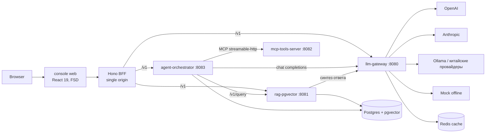

# AI Platform — обзор портфолио (github.com/INTERpol21)

Пять связанных репозиториев: четыре Python/FastAPI-бэкенда и TypeScript-консоль
над ними. Вместе — работающий мини-стек AI-платформы, который поднимается офлайн
одной командой, без единого реального API-ключа (мок-провайдер, детерминированные
эмбеддинги, заглушка поиска). Реальные провайдеры подключаются конфигом.

Этот документ — обзор всей платформы. README каждого репозитория описывает сам
репозиторий; решения зафиксированы в [ADR](adr/README.md), незакрытые работы — в
[ROADMAP](ROADMAP.md).

## Репозитории

| Репо | Что демонстрирует | Порт |
|---|---|---|
| [llm-gateway](https://github.com/INTERpol21/llm-gateway) | OpenAI-совместимый шлюз: каталог моделей и ping, YAML-роутинг с wildcard, SSE-стриминг, фолбэки/ретраи, Redis-кэш, rate-limit, учёт токенов и стоимости | 8080 |
| [rag-pgvector](https://github.com/INTERpol21/rag-pgvector) | RAG на pgvector: ингест (md/txt/pdf/docx), гибридный поиск (вектор + BM25/FTS через RRF), reranker, цитаты источников, eval-харнес и promptfoo OWASP-LLM гейт | 8081 |
| [mcp-tools-server](https://github.com/INTERpol21/mcp-tools-server) | MCP-сервер (FastMCP): инструменты + resources, sqlite-authorizer, песочница путей, stdio + streamable-http | 8082 |
| [agent-orchestrator](https://github.com/INTERpol21/agent-orchestrator) | LangGraph-агент: план → инструменты → рефлексия → синтез; SSE-стриминг, Postgres-чекпойнтер, история прогонов; оркеструет остальные три сервиса | 8083 |
| [llm-platform-console](https://github.com/INTERpol21/llm-platform-console) | React 19 + Hono BFF: шесть разделов (Research, Models, Usage, Knowledge, Telemetry, Mission-control), FSD, контракты через Kubb, i18n RU/EN | 5173 / BFF 8787 |

## Связи сервисов



Браузер ходит только в BFF — единый origin, ключи не уезжают в клиент
([ADR-0008](adr/0008-bff-single-origin.md)). Все бэкенды говорят на общем
префиксе `/v1` ([ADR-0007](adr/0007-unified-v1-prefix.md)), поэтому BFF —
тонкий прокси, а не слой перевода.

## Запуск всей платформы

Зонтичный compose поднимает всё: Postgres, Redis, четыре бэкенда, BFF, Caddy и
опциональный Ollama.

```bash
cd llm-platform-console
docker compose up -d --build --wait
```

Кросс-сервисный смоук поверх поднятого стека:

```bash
python scripts/platform_smoke.py
```

Он проверяет реальные связи, а не отдельные сервисы: completion и кэш шлюза,
ингест и цитируемый ответ rag (синтез идёт через шлюз — виден в `/v1/usage`),
инструменты MCP по streamable-http, `/v1/research` оркестратора end-to-end.
Браузерную часть покрывает Playwright + axe (`web/e2e`).

Отдельные сервисы для разработки — см. README соответствующего репозитория; у
каждого есть `make install && make run` и офлайн-дефолты.

## Инженерная база

Во всех пяти репозиториях: слоистый скелет (`api` / `services` / `db` /
`core`), uv + lockfile и mypy-гейт на Python-стороне, структурные JSON-логи со
сквозным `X-Request-ID`, non-root Docker с HEALTHCHECK, CI с ruff/pytest и
security-гейтами (pip-audit, bandit, CodeQL, Dependabot), ADR и CONTRIBUTING.
У rag дополнительно eval-гейт по hit-rate и promptfoo-прогон на границе синтеза.
