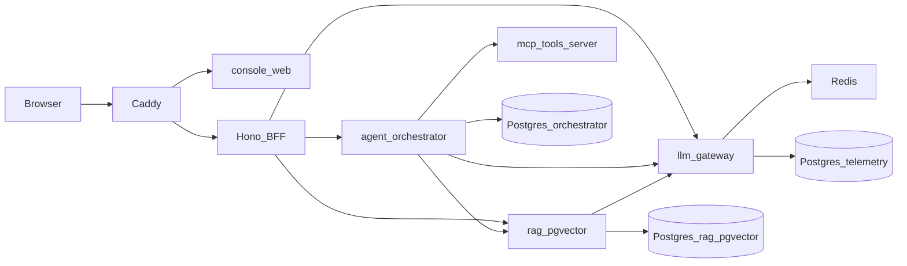

# Roadmap

> Checkbox convention: `- [ ]` planned, `- [~]` **in progress right now**,
> `- [x]` done (struck through, with date and release). The Mission-control
> panel renders this file live from `main`, so status edits here show up in
> the console within a minute of merging.

What's done, what's next, and why — for the whole platform (four backends + this
console). Companion to the [ADRs](adr/README.md): ADRs record decisions already
made; this file records work not yet done. Effort tags: **S** ≈ hours, **M** ≈ a
day, **L** ≈ multiple days. Architecture map: [PLATFORM_OVERVIEW.md](PLATFORM_OVERVIEW.md)
and the **Project map** section below. Russian memory of the same story:
[HISTORY.ru.md](HISTORY.ru.md).

Done items stay in place, struck through — the history of what it took is part
of the story this repo tells.

**Current focus (2026-07-24): M9 — Public demo.** Phase 1 hardening is closed;
the portfolio's biggest gap is that nobody can *see* the stack. Semantic-cache
v1 (gateway-only) shipped as gateway 1.3.0 and is paused for follow-ups.
Design (M7) and replicas/k6 (M8 e/f) wait until a public stand exists — or, for
M7a/M7b, run in parallel once seed data makes Knowledge clickable.

## Project map — who owns what, how it wires

Five repos under `github.com/INTERpol21`. One umbrella compose in
`llm-platform-console` brings them up. Browser never holds API keys.

| Repo | Owns | Listens | Calls | Shared state |
|---|---|---|---|---|
| **llm-gateway** | Completions, embeddings, model catalog/ping, YAML routing, exact + semantic cache, Redis circuit breakers, usage/cost ledger (`model_runs`) | `:8080` `/v1/*` | Upstream providers (OpenAI, Anthropic, Ollama, CN, mock) | Redis (cache, breakers); Postgres `telemetry` schema |
| **rag-pgvector** | Ingest (JSON + file + folder watch), hybrid retrieval (vector + BM25/FTS + RRF), rerank, citations, evals/promptfoo | `:8081` `/v1/*` | gateway `/v1/embeddings` + chat for synthesis | Postgres `rag` schema + pgvector |
| **mcp-tools-server** | MCP tools/resources (search stub, read-only SQL, path sandbox); bearer on streamable-http | `:8082` `/mcp` | — (leaf) | Local sqlite demo DB; no platform Postgres |
| **agent-orchestrator** | LangGraph research (plan → execute → reflect → synthesize), SSE stream, thread history | `:8083` `/v1/*` | gateway (chat), rag (`/v1/query`), mcp (tools) | Postgres `orchestrator` schema (checkpointer) |
| **llm-platform-console** | React SPA (6 sections), Hono BFF (key injection, rate-limit, body caps, SSE passthrough, live roadmap), Caddy single-origin, umbrella compose, `platform_smoke.py` | Caddy `:8080` → web + BFF `:8787` | gateway, rag, orchestrator via BFF; **not** mcp today (gap → M7a) | — |

**Working linkages** (asserted by `scripts/platform_smoke.py` 10/10):

1. Browser → Caddy → BFF → gateway completion + cache headers
2. BFF → rag ingest + query; rag → gateway embeddings; synthesis cost appears in gateway `/v1/usage`
3. Orchestrator → rag retrieval + gateway chat + MCP tools; SSE research end-to-end through BFF
4. Mission-control → BFF `/api/roadmap` → this file on `main`

**Known broken / missing linkages** (tracked below):

- Mission-control health board does **not** probe mcp → board can be green with MCP down
- Knowledge UI has no upload / list / delete (rag has `/v1/ingest/file`; no list/delete API yet)
- Console always opens a fresh research thread (orchestrator history API exists unused)
- Semantic cache is in-process per gateway replica; not shared via Redis; not invalidated on rag ingest

**Doc sync rule:** closing a ROADMAP checkbox with a release → update the version
table in [HISTORY.ru.md](HISTORY.ru.md) the same day.

## Status snapshot (delivered)

- **Backends (M1–M3):** layered-skeleton refactor of all four; uv+lock, mypy gate,
  structured JSON logs + `X-Request-ID`, non-root Docker + HEALTHCHECK, security
  CI (pip-audit, bandit, CodeQL, Dependabot).
- **Features:** gateway model catalog + ping + Chinese/Ollama providers +
  `/v1/embeddings` + semantic answer cache (opt-in); orchestrator SSE research +
  Postgres/Memory checkpointer + history + model passthrough; rag DB opts
  (indexes, HNSW, dim-guard, batch upsert) + local-first source tags + file
  ingest (md/txt/pdf/docx) + folder connector; rich telemetry (Postgres
  `model_runs`/`research_runs`); hardening (idempotency, cursor pagination,
  circuit breaker, per-hop timeouts).
- **Security:** untrusted-context fencing + defang (LLM01/08); a promptfoo
  OWASP-LLM gate on the RAG synthesis boundary (`rag/evals/promptfoo`).
- **Console (M4):** six sections (Research, Models, Usage, Knowledge, Telemetry,
  Mission-control), strict FSD (Steiger), CSS Modules, i18n RU/EN, Kubb contracts,
  Hono BFF; unified `/v1` across services.
- **Quality:** jsdom axe a11y gate + Playwright e2e; deps current as of 2026-07
  (TypeScript 7, Node 26, Python 3.14 images, React 19, Vite 8, Vitest 4, Zod 4,
  Kubb 4, pnpm 11 pinned via `packageManager`); ADRs (11) + CONTRIBUTING +
  CLAUDE.md agent maps in every repo.
- **Runs for real (2026-07-20):** the whole 8-container stack builds and comes up
  healthy on a laptop, with `scripts/platform_smoke.py` green 10/10 both direct
  and through Caddy+BFF. Getting there took six fixes that no unit suite caught,
  because every suite mocks its neighbours: two lockfile/dependency drifts, a
  missing `/v1` in the orchestrator's RAG client (every retrieval 404'd, and the
  agent degraded quietly into evidence-free answers), and three pnpm 11
  breakages that had left the BFF and web images never-built.
- **Toolchain current + releases automated (2026-07-21):** TypeScript 5.9→7,
  Node 22→26, Python 3.10→3.14, redis-py 5→8 — verified by building and driving
  the live stack, which surfaced two real console bugs on the first-ever
  Playwright run (the SSE parser dropped every real orchestrator frame; two
  WCAG-AA contrast failures). All five repos released as v1.0.0; tagging is now
  automatic from the manifest version (tag-release.yml), with CHANGELOG sections
  as release notes.
- **Code-level audit (2026-07-23):** multi-agent survey produced a CLAUDE.md map
  per repo and a verified finding list. Fixed: Unicode-blind retrieval in rag
  (any Russian corpus 500'd BM25 *and* embedded to the zero vector),
  `EMBEDDING_DIM` ignored by the openai embedder, an asyncpg pool leak on the
  fail-fast path, MCP error paths leaking absolute server paths, a healthcheck
  blind to `MCP_PORT`, unlogged tool rejections, dead code, and a stack of
  README/config drift (stale base images, test counts, env examples, ruff pins).

## ~~Now — unblock and close out~~ Closed out (kept for history)

- [x] ~~**Publish the console repo & push.**~~ Done — the repo is at
      `INTERpol21/llm-platform-console` and `main` is pushed.
- [x] ~~**Bring the stack up for real.**~~ Done 2026-07-20 — see the delivered
      snapshot for what it found.
- [x] ~~**Run the browser e2e for real.**~~ Done 2026-07-21 — first-ever run
      found two real bugs (SSE wire-format mismatch, WCAG-AA contrast); 4/4
      green locally and in CI since.
- [x] ~~**Cover the cross-service links in CI.**~~ Done — `platform_smoke.py`
      runs in the `e2e` job; each backend fails CI when `requirements.txt`
      drifts from `uv.lock`. Between them these gates reproduce every defect
      the first real run turned up.
- [x] ~~**Tag releases.**~~ Done, then automated: all five repos carry v1.0.0
      and tag-release.yml cuts every future release from the manifest version.
- [x] ~~**`/v1/embeddings` passthrough (gateway).**~~ Route shipped with the
      completions routing/fallbacks/breakers/cost accounting. The rag half
      moved to *Consolidate* below.

## ~~Now — consolidate what exists (priority 1)~~ Closed out

The platform works end-to-end. Before growing it, make what exists boringly
solid: close the halves, wire the skipped tests, and finish the stories the
audit opened.

- [x] ~~**rag: `gateway` embedder backend.**~~ Done 2026-07-23 (rag 1.1.0): the
      umbrella stack embeds through the gateway's `/v1/embeddings`, so
      completions, research and embeddings share one usage/cost ledger. The
      smoke asserts the new link: with `embeddings=gateway` the gateway ledger
      must grow after a rag query.
- [x] ~~**rag: real multilingual retrieval.**~~ Done 2026-07-23 (rag 1.2.0):
      Snowball stemming across all three legs — Postgres FTS on the `russian`
      config (Cyrillic via russian_stem, ASCII via english_stem), the memory
      BM25 leg and offline embedders on the identical algorithms via
      `snowballstemmer` (stems verified equal to Postgres's). Guarded by a
      textnorm suite pinned to Postgres output, an inflected-query pgvector
      integration test, and a Russian eval corpus. Verified live end to end.
- [x] ~~**rag: run the skipped pgvector tests in CI.**~~ Done 2026-07-23: a
      `pgvector/pgvector:pg16` service container backs the test job — 87 tests,
      zero skips, and the job fails loudly if the pgvector skip reason ever
      reappears.
- [x] ~~**gateway: finish the route `kind` story.**~~ Done 2026-07-23
      (gateway 1.1.0). Policy: /v1/embeddings serves both kinds
      (multi-capability chat aliases + dedicated `kind: embedding` aliases —
      `text-embedding-3-small` with a mock fallback ships in models.yaml);
      /v1/chat/completions rejects embedding aliases with a plain-words 404.
      The mock demo path is untouched; verified live and by 3 new tests.
- [x] ~~**orchestrator: parallel independent plan steps.**~~ Done 2026-07-23
      (orchestrator 1.1.0): execute fans all remaining plan steps out with
      asyncio.gather — safe because reflect only appends follow-ups after the
      node; results collect in plan order so traces and citation numbering
      stay deterministic; per-step degradation survives the fan-out. Guarded
      by a rendezvous test that deadlocks under sequential execution.
- [x] ~~**mcp: bearer auth on streamable-http.**~~ Done 2026-07-23
      (mcp-tools-server 1.1.0 + agent-orchestrator 1.2.0): /mcp requires
      `Authorization: Bearer` with a key from `MCP_API_KEYS` (constant-time,
      401 + WWW-Authenticate otherwise); the orchestrator client sends
      `MCP_API_KEY`; both default to the platform's shared `demo-key` and the
      umbrella compose wires `PLATFORM_KEY` into each. stdio stays open —
      its client is whoever spawned the process.
- [x] ~~**CI: test on the production Python.**~~ Done 2026-07-23: setup-uv pins
      python-version 3.14 in every backend job, after a local 3.14 run of all
      four suites proved green first.
- [x] ~~**One-command verify.**~~ Done 2026-07-23: `make verify` (and
      `make verify E2E=1`) in the console repo — stack up on a configurable
      port (8080 is habitually taken locally), smoke, optional Playwright,
      guaranteed teardown via trap.
- [x] ~~**rag: re-embed on backend switch.**~~ Done 2026-07-24 (rag 1.3.0):
      embedders carry a vector-space fingerprint (model+dim, deliberately not
      URL — gateway vs direct with the same model does not re-embed); the
      store records it (pgvector: index_meta, migration 008) and startup
      re-embeds the whole corpus on mismatch before serving traffic.
      Pre-fingerprint stores are adopted as-is. Verified live in the umbrella
      stack: model switch logged reembedded:3 both ways, smoke 10/10.
- [x] ~~**Console: feed Mission-control from reality.**~~ Done 2026-07-24
      (console 1.1.0): RoadmapPanel now renders THIS file — sections and
      checkboxes parsed from docs/ROADMAP.md at build time via a Vite ?raw
      import (no endpoint, no fetch; every roadmap change ships through an
      image rebuild anyway). The hardcoded M1-M5 board and its i18n keys are
      gone. The GitHub-status widget below remains a natural pairing.

## Design track — M7 (Phase 3; split by ROI)

Decided 2026-07-24: visual redesign and console UX gaps are one dedicated
track, kept apart from backend milestones so neither blocks the other.
**Order inside the track:** M7a (expose) → M7b (hardening) → M7c (redesign).
Do not polish an empty Knowledge tab before upload/list work.

### M7a — Expose what the backends already do (high ROI)

- [ ] **rag: `GET /v1/documents` + `DELETE /v1/documents/{id}`.** Blocker for
      Knowledge list/delete UI; folder connector deliberately does not propagate
      deletions until a delete surface exists on the store. **Size:** S.
- [ ] **BFF: MCP health probe.** Wire mcp-tools-server into the Mission-control
      health board (`/api/mcp/healthz` or an aggregated probe). Today the board
      can be all-green while MCP is down — orchestrator tools then degrade
      quietly. **Size:** S.
- [ ] **Console: Knowledge upload + document list/delete.** UI over existing
      `/v1/ingest/file` (md/txt/pdf/docx) and the new list/delete endpoints.
      **Size:** M.
- [x] ~~**Live roadmap in Mission control.**~~ Done 2026-07-24 (console
      1.2.0): the panel fetches this file from main via the BFF
      (`/api/roadmap`, 60 s cache) and refreshes every minute; `- [~]` items
      render as "In progress". Plan edits are visible online, no rebuild.

### M7b — Console hardening (with / before public stand)

- [ ] **Console hardening (found by the 2026-07-24 frontend audit).**
      Ping failures are swallowed (`usePingModel` has no onError — a dead
      model looks like "nothing happened"); numeric inputs ship raw
      `Number(...)` to the API (top_k / priority / max_iterations can be NaN
      or out of range); no route code-splitting or manualChunks, so recharts,
      both locales and the full Zod contract trees load eagerly (the vite
      chunk-size warning); `useResearchStream`, `shared/api/client.ts` and
      the ingest/search forms have zero direct tests. Also: damp the
      live/baked roadmap flip-flop in the Mission-control panel (moved here
      from M8(h) — frontend concern). **Size:** M.

### M7c — Calm-minimalism redesign (after demo is clickable)

- [ ] **Console: calm-minimalism redesign.** A design critique of the live UI
      (2026-07-23) named the dirt: the graph-paper background fights the
      content in both themes, and monospace leaks from data into headings —
      "hacker dashboard" instead of an operator console. Direction chosen:
      Linear/Geist-style calm minimalism — no background grid, surface layers
      instead of border-boxes, mono only for data (numbers, model ids, trace),
      a 32/16 spacing scale, one accent, one badge style. All in tokens.css +
      module CSS; axe/e2e gates already guard contrast. **Size:** M.

## Scale-out track — M8 (next major backend theme)

Decided 2026-07-24 after a scaling audit of all five services. Today
everything is single-process and single-replica; the platform Postgres and
Redis are shared, but resilience state is not. Order matters: correctness
first (a, b), then caps (c), then actual replicas (e).

Plan of record (2026-07-24, three phases): **Phase 1** = (c), (d), (g), (h) —
hardening that is also a prerequisite for a public demo (**closed**);
**Phase 2** = the Public demo track below; **Phase 3** = Design track M7
(a→b→c). (e) replicas and (f) k6 are deliberately deferred until the public
stand exists — load numbers and replica stories only mean something against
something reachable.

- [x] ~~**(a) umbrella: durable orchestrator.**~~ Resolved 2026-07-24 as
      already true: the audit claim was wrong — the umbrella compose DOES set
      `ORCH_DATABASE_URL` (checkpoints in the `orchestrator` schema).
      Verified live: a research thread's `/research/history` returned
      `exists: true` after a container restart. No code change needed.
- [x] ~~**(b) gateway: shared resilience state.**~~ Done 2026-07-24 (gateway
      1.2.0): Redis-backed circuit breakers — TTL trip/cooldown, exactly one
      HALF_OPEN probe fleet-wide via SET NX, fail-open when Redis is down;
      REDIS_REQUIRED fail-fast (the umbrella sets it) and ERROR-level
      DEGRADED logs instead of the old silent warning; telemetry INSERT moved
      off the hot path (bounded fire-and-forget, flushed on shutdown);
      telemetry pool exposed as TELEMETRY_POOL_MIN/MAX_SIZE.
- [x] ~~**(c) platform: request caps + auth unification.**~~ Done 2026-07-24
      (rag 1.4.0, orchestrator 1.3.0, mcp 1.1.1, console 1.4.0): Content-Length
      413 gates in rag (10 MiB) and the orchestrator (1 MiB), hono bodyLimit
      in the BFF (12 MiB, also counts chunked streams); rag and mcp key
      comparison made non-short-circuiting — the whole platform now keeps the
      strict timing-safe contract. Verified live: 413s at every layer, normal
      traffic and smoke 10/10 intact. Note: the header-based caps are
      advisory against lying clients — the enforced bound remains the schema
      limits (BFF's stream counter is the exception).
- [x] ~~**(h) hardening backlog from the 2026-07-24 adversarial audit.**~~
      Done 2026-07-24 (gateway 1.2.2, console 1.4.2): /api/roadmap got
      single-flight + a 1 MiB body cap and moved before the rate limiter;
      telemetry shutdown flush is deadline-bounded (5 s, stragglers
      cancelled). The one frontend leftover — live/baked panel flip-flop
      damping — moved into the M7b console-hardening item. Backend side of
      the audit backlog is closed.
- [x] ~~**(d) hot-path connection reuse + pool knobs.**~~ Done 2026-07-24
      (rag 1.5.0, orchestrator 1.4.0): OpenAIEmbedder/OpenAIChatLLM and
      GatewayLLM/RagClient each hold one shared keep-alive httpx client per
      instance, closed by the lifespans (rag's /v1/query used to open two
      throwaway pools per request). rag's embedder also gained the missing
      trust_env=False. rag asyncpg pool exposed as DB_POOL_MIN/MAX_SIZE.
      MCP stays session-per-call by design (the handshake IS the session).
- [ ] **(e) replicas for real.** compose `--scale` for gateway/rag behind
      Caddy load-balancing, `WEB_CONCURRENCY`/`--workers` knob in the
      uvicorn CMDs, BFF rate limiter to Redis (or delegate limiting to
      Caddy), then document what N replicas actually changes. Depends on (b).
      Also the natural home for a Redis-shared semantic cache. **Size:** L.
- [ ] **(f) load tests (k6) on the hot paths** — moved up from Later: numbers
      before and after (b)-(e) are the whole point. **Size:** M.
- [x] ~~**(g) CI + build speed.**~~ Done 2026-07-24 (console 1.4.1 + a
      Dockerfile chore in all four backends): CI healthchecks poll every 2 s
      via the compose overlay (and the e2e `up` now actually APPLIES that
      overlay — it silently didn't); Trivy DB cached between runs; BFF image
      686 -> 475 MB (`--prod --filter`, tsx moved to runtime deps; the rest
      is the node:26-slim base); pip BuildKit cache mounts in every backend
      Dockerfile. First post-merge run pays cold caches once.

## Public demo track — M9 (Phase 2: CURRENT FOCUS — make the platform visible)

Decided 2026-07-24: the portfolio's biggest gap is that nobody can SEE it —
the whole platform lives in a local compose. The stack runs fully offline on
mock models, so a public stand costs no API keys. Phase 1 hardening (M8 c/d)
is the security prerequisite: no public ingest without body caps.

- [ ] **Deploy the umbrella stack publicly** (promoted from Later). One small
      VM or Fly/Render, mock mode, the existing Caddy as the front door;
      scheduled demo-data reset; rate limits already exist. **Size:** L.
- [ ] **Public threat model / demo lock-down.** Document and enforce what is
      open behind `demo-key`: ingest write? folder watch? Confirm BFF per-IP
      rate limits are enough on a cheap VM; optionally read-only Knowledge +
      disable file ingest on the stand; separate `PUBLIC_DEMO_KEY` from local
      `demo-key`. README must say not-for-production. **Size:** M.
- [x] ~~**Seed + reset as code.**~~ Done 2026-07-24 (console main): `demo/seed/`
      — 6 bilingual notes about the platform itself; `make demo-seed` copies
      them into ./dropbox (folder connector ingests in ~5 s), `make demo-reset`
      truncates the rag tables, flushes Redis and re-seeds. Verified live:
      reset -> 7 documents, a Russian question retrieves hybrid-search with
      citations.
- [ ] **Smoke-against-public.** After deploy: `platform_smoke.py` (or a
      trimmed subset) against the public origin — CI schedule or manual job.
      **Size:** S.
- [x] ~~**README showcase.**~~ Done 2026-07-24 except the live URL (blocked
      on deploy — placeholder says "coming soon"): 2-minute what-to-click
      tour, five-repo map, not-for-production/demo-key disclaimer; all four
      backend READMEs now point at llm-platform-console as the umbrella hub.
      Screenshots land together with the live URL.
- [ ] **GitHub profile pins.** Pin 3–4 repos: console (face), mcp, rag,
      gateway or orchestrator — so the D-11 package is visible without hunting.
      **Size:** S.
- [ ] **Demo hygiene (first-click quality).** Seeded corpus and example
      research questions so the first click lands on something impressive, not
      an empty Knowledge tab. Overlaps seed+reset; keep as the acceptance
      criterion for the public stand. **Size:** S.

### M9 — verify before / right after going public

Not features — gates. Fail any of these and the stand hurts the portfolio.

- [x] ~~**Mock first-click impresses**~~ — *Verified live 2026-07-24:* after
      `make demo-reset` Knowledge holds the 7-note seeded corpus; a Russian
      query returns the hybrid-search note with [n] citations. Re-verify once
      the stand is public.
- [x] ~~**Public ingest abuse bound**~~ — *Flood-tested live 2026-07-24:*
      30 consecutive 13 MiB ingests -> all 413 (nothing buffered); 350-request
      burst -> exactly 241x200 + 109x429 with Retry-After (the 240/min token
      bucket working to spec); every service healthy afterwards. Re-run
      against the public origin after deploy.
- [ ] **Five READMEs agree** on "run the umbrella from console" and point at
      the live URL once it exists.
      *Docs pass 2026-07-24:* backends document their own `docker compose`;
      only orchestrator names the four-service platform; none point at
      `llm-platform-console` as the umbrella hub. Console README has no
      live-URL/showcase section yet (blocked on deploy).
- [ ] **CI green on `main`** for all five repos (e2e + Trivy where applicable).
- [ ] **Licenses + demo-key disclaimer** visible in console README.
      *Docs pass 2026-07-24:* `LICENSE` file exists; console README has no
      "not for production" / demo-key warning text — add with showcase.
- [ ] **Confirm research-history gap** before scheduling "Research sessions"
      work (orchestrator `/v1/research/history` exists; console always fresh).
      *Confirmed 2026-07-24:* BFF proxies history; web UI has `threadId` on the
      stream client but no history fetch / thread picker — gap is real.
- [x] ~~**Semantic cache false-positive on `mock-embedding`**~~ — *Measured
      2026-07-24:* trigram vectors score antonym swaps dangerously high
      ("включи X" ~ "выключи X" = 0.904), so 0.90 could serve the OPPOSITE
      answer; true near-verbatim paraphrases score >= 0.96. The umbrella now
      runs threshold 0.95 — verified live: antonym misses, paraphrase hits at
      0.988. A real semantic-paraphrase demo needs a real embedding model.

## Next — new capabilities (priority 2; after M9 skeleton)

- [x] ~~**Folder connector (local-first).**~~ Done 2026-07-24 (rag 1.6.0 +
      umbrella `./dropbox` mount): a background task polls INGEST_WATCH_DIR
      and auto-ingests md/txt/pdf/docx (subfolders included, id = relative
      path); content-hash dedup makes rescans free, bad files are logged and
      skipped, the loop survives store outages. Verified live: a file dropped
      into ./dropbox was searchable in ~10 s. Deletions deliberately not
      propagated (no delete surface on the store yet — see M7a).
- [x] ~~**Semantic answer cache (gateway v1).**~~ Done 2026-07-24 (gateway
      1.3.0): opt-in `SEMANTIC_CACHE_ENABLED`; embeds via the gateway's own
      embedding pipeline (default `mock-embedding`); hit when cosine ≥
      `SEMANTIC_CACHE_THRESHOLD` (0.97); non-streaming + `temperature=0` only;
      partition by (model, cache scope, max_tokens); bounded in-process FIFO;
      `X-Cache: semantic` + `X-Semantic-Score`. Embedding failure skips the
      cache — never fails a completion. **Out of scope for v1 (follow-ups
      below):** ingest invalidation, rag-side cache, Redis-shared across
      replicas.
- [ ] **Semantic cache follow-ups.** (a) ADR documenting threshold / temp=0 /
      partition invariants; (b) invalidate-or-bust policy on rag ingest
      (explicitly deferred — wrong answers are worse than a miss); (c)
      Redis-shared variant with M8(e). Verify false-positive behaviour on
      `mock-embedding` before enabling on the public stand. **Size:** M.
- [ ] **Event-bus + live console updates.** A lightweight in-process event bus
      (ingest progress, new research run, model ping/status) surfaced to the
      console as an SSE feed through the BFF, so Mission-control and Knowledge
      push live instead of polling. **Where:** backends emit → BFF
      `/api/events` passthrough → web `entities/service-health` + a new
      `entities/activity`. **Size:** L.
- [ ] **GitHub branch/CI status in Mission-control.** Read-only: each repo's
      default-branch CI status and open PRs next to the roadmap. **Where:** BFF
      proxies the GitHub API (token server-side) → a `mission-control` widget.
      **Size:** M.
- [x] ~~**Trivy image scan in CI.**~~ Done 2026-07-23: the e2e job (the only
      place all six images exist) gates on CRITICAL-with-a-fix; unfixable
      base-image HIGHs deliberately do not block (debian's perl carries
      perpetual ones). The first scan already paid for itself: node-tar CVE in
      the BFF image, fixed by deleting npm from the runtime image entirely —
      the container only ever invokes pnpm.
- [ ] **Revisit the supply-chain quarantine (ADR-0011).** Now that Trivy gates
      the images, reconsider reinstating a short `minimumReleaseAge` (e.g. 60
      minutes — most npm-takeover windows die in the first hour) and/or widening
      the Trivy gate to HIGH-with-a-fix once the base images stabilize. Both are
      one-line changes; the point is to make the decision deliberately.
      **Size:** S.
- [ ] **Slim runtime images further.** Deleting npm from the BFF image both
      killed a CVE and shrank the attack surface — the same lens applies
      elsewhere: multi-stage the BFF (install stage + runtime stage without
      pnpm), pin base images by digest, add a non-root USER to the node images
      (the Python images already have one). **Size:** M.
- [ ] **Research sessions in the console.** The orchestrator already keeps
      checkpointed history per thread (`/v1/research/history`); the console
      starts a fresh thread every time. Thread picker + follow-up questions on
      an existing thread turns the demo into a usable research tool. **Size:** M.

## Portfolio / narrative

- [ ] **Resume ↔ stand link.** Branch 05 / Master: live URL + "one compose up";
      refresh bullets for gateway embeddings, Redis breakers, folder connector,
      semantic cache. **Size:** S.
- [ ] **Eval numbers in rag README.** Publish hit-rate / promptfoo gate results
      (market signal for LLM evals). Numbers already exist in-repo. **Size:** S.
- [ ] **Sync HISTORY.ru.md versions** after every milestone release (process,
      not a feature). **Size:** S.
- [ ] **Workspace pointer.** Cursor stub at `Резюме/AI_Portfolio` should README-
      point at `Desktop/DEVELOP.nosync/AI_Portfolio` so agents do not explore an
      empty tree. **Size:** S.

## Later — post-MVP

- [ ] **Full OpenTelemetry** (traces + metrics across services + BFF;
      Prometheus / Grafana) on top of the existing correlation-id. **Size:** L.
- [ ] **Shared Python contract models** — dedupe the OpenAI schema repeated
      across backends. **Size:** M.
- [ ] **Production embeddings** (OpenAI / BGE) and a larger corpus, past the
      offline deterministic embedder. **Size:** M.
- [ ] **Multitenancy & quotas** instead of `demo-key`, plus human-in-the-loop
      for sensitive tool actions. **Size:** L.
- [ ] **Cost budgets & alerts** per key/model. **Size:** M.
- [ ] **Checkpointer retention** — TTL/cleanup + backups for the growing
      `orchestrator` and `telemetry` tables (idempotency keys especially).
      **Size:** M.
- [ ] **Model comparison side-by-side** + conversation export. **Size:** M.

## Known constraints (environment, not code)

- The cloud dev sandbox runs a Docker daemon but its egress proxy blocks Docker
  Hub's blob CDN — image pulls 403 there. On a developer laptop and in GitHub
  CI, all eight images build and run (verified repeatedly since 2026-07-20).
- In the umbrella stack the backends are **not** published on the host: Caddy
  owns `:8080` and everything else is reached through it via the BFF. To hit a
  backend directly (e.g. for the smoke script's `--direct` mode) publish its
  port with a compose override; `SMOKE_*_PORT` env vars let the script follow a
  remapped port when another local dev server already owns 8080-8083.
- The GitHub integration has push access to existing repos but not
  repo-creation; new repos must be created by a human first.
